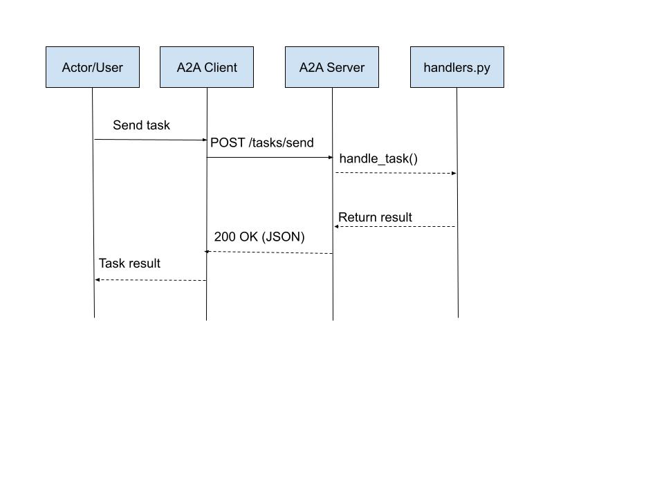

## Section 3
26. The request uses a client-generate id rather than a server-generate one since the client can track the request without the server. It solves idempotency, where a new request can duplicate the task if the server generates the id. 
27. A server would return this state in a non-streaming call when it has accepted the task but has not finished it yet. The client should not accept it as the result.
28. The sessionId field associates  multiple tasks together into a single ongoing operation. It allows the server to remember past data and conversation history. If the user asks to summarize an article and then after asks for a shorter version, the server can reuse the old summary to generate a newer, shorter version. 
If the user asks to list the top 5 articles to learn computer science, the server can generate this. If the user then asks to compare article 1 and 2, the server can remember these articles and return the relevant answers.
29. One example would be asking the agent to analyze quarterly earning files. The user would provde the files that the server would analyze, text would involve user instructions such as extracting key points, and data would be something returned, such as a structured format of the earnings in JSON.

## Section 4
37. (a) The --allow-unauthenticated flag makes the Cloud Run service publicly accessible over HTTP/HTTPS without requiring Google authentication. It risks public exposure, where anyone can attack the endpoint. There is also no identity verification and risk for Ddos or spam attacks.
(b) Cloud Run automatically adjusts the number of running instances. When there is traffic, it scales up and when idle it scales down to zero instances. Cold start latency refers to the delay when the service is at zero and a new request arrives. For A2A clients, it means occasional higher latency on initial requests.

## Section 5
42. (a) Cloud Run gives you more control, but also more operational responsibility. You are responsible for things like containerizing the app, choosing the HTTP interface, and managing routes and server startup. It is a better fit when you want a standard web service. Agent Engine reduces some operational burden because Google manages more of the agent runtime for you. You do not focus as much on HTTP server setup. It is a better fit when the main goal is deploying an agent abstraction, not a full custom web app.
(b) The wrapper class uses a synchronous query() method even though the underlying handler is async because the Agent Engine interface expects a synchronous callable shape for the deployed agent wrapper.

## Section 6
44. [REQUEST] GET https://echo-a2a-agent-701351129873.us-central1.run.app/.well-known/agent.json
[RESPONSE] 200 https://echo-a2a-agent-701351129873.us-central1.run.app/.well-known/agent.json
Agent name: Echo Agent
Skills:
  - Echo
  - Summarise
[REQUEST] POST https://echo-a2a-agent-701351129873.us-central1.run.app/tasks/send
          payload={'id': 'a94265b6-cccf-43d0-ac5d-ded75d5ecc63', 'text': 'Hello from the client!'}
[RESPONSE] 200 https://echo-a2a-agent-701351129873.us-central1.run.app/tasks/send
           status={'state': 'completed'}

Response:
Hello from the client!

45. 
46. The client should reuse the same task ID when retrying, resend the exact same request (same payload + same id), and let the server decide if it’s a duplicate. The server should not execute the task again and just return the result associated with the task id.